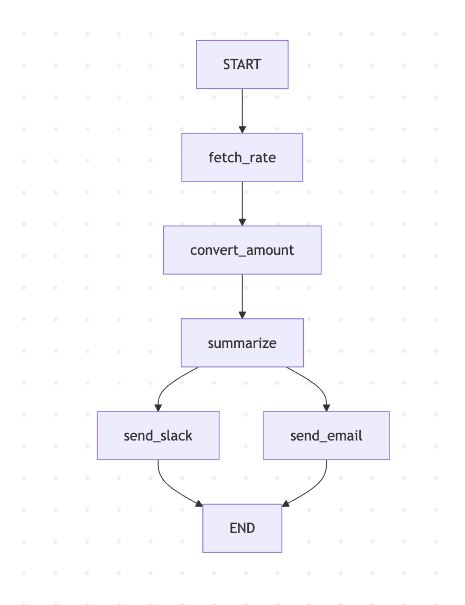

# Currency Conversion Workflow with LangChain + LangGraph + Gemini 2.5

This project demonstrates a currency conversion workflow built using **LangChain**, **LangGraph**, and **Google Gemini 2.5**.  
It fetches exchange rates, converts an amount, summarizes the transaction, and sends results via Slack and Email.

## 1. Install Dependencies

npm install

## 2. Create .env File
API_KEY=your_exchangerate_api_key
GEMINI_API_KEY=your_gemini_api_key

Replace your_exchangerate_api_key and your_gemini_api_key with your actual API keys.

## 3. Start the Server
node server

## 4. Workflow Diagram (Mermaid)
The graph.mmd file is generated by the code and can be used to update the workflow diagram.

Paste this code into Mermaid Live Editor to visualize:

graph TD
  START --> fetch_rate
  fetch_rate --> convert_amount
  convert_amount --> summarize
  summarize --> send_slack
  summarize --> send_email
  send_slack --> END
  send_email --> END

5. Workflow Diagram (PNG)

6. Notes

The graph.mmd file is generated by the code and can be used to update the workflow diagram.

The graph.png should be exported from Mermaid Live Editor or generated using Mermaid CLI:

npm install -g @mermaid-js/mermaid-cli
mmdc -i graph.mmd -o graph.png

Website: SEO InfoTech
